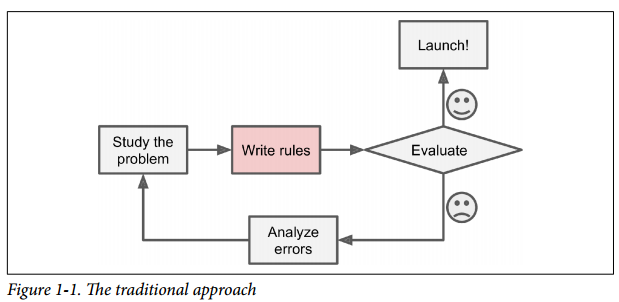
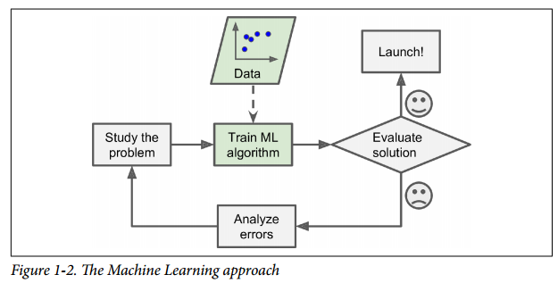
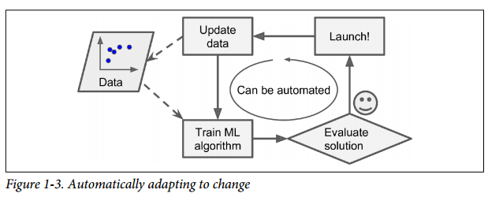
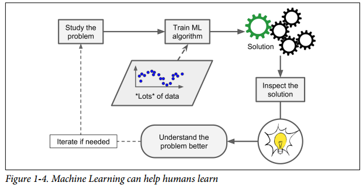
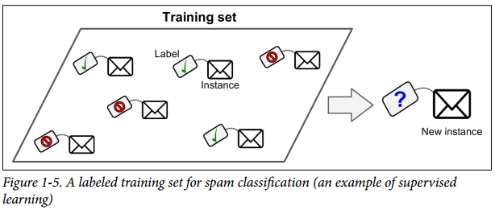
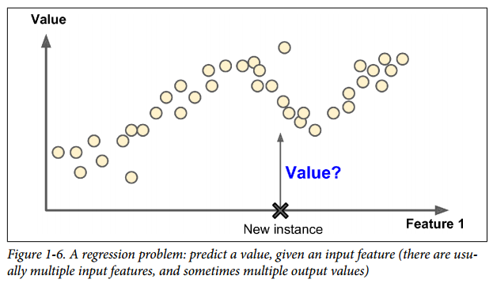

# 什么是机器学习(Machine Learning)

1. > [Machine Learning is the] field of study that gives computers the ability to learn
without being explicitly programmed.
—Arthur Samuel, 1959

   > 使得计算机具有学习的能力，这一切不需要显式地通过编程实现。

2. > A computer program is said to learn from experience E with respect to some task T
and some performance measure P, if its performance on T, as measured by P,
improves with experience E.
—Tom Mitchell, 1997

   > 任务，知识，度量

# 举例：垃圾邮件过滤器
## 传统方法

## 机器学习

## 自动适应变化

## 帮助人们学习到知识
* (经典的例子有"啤酒和尿布"，注意这里是机器学习，不是深度学习)

# 应用举例
1. > Analyzing images of products on a production line to automatically classify them.

   > 图片分类，典型情况下使用convolutional neural networks (CNN, 卷积神经网络)

2. > Detecting tumors in brain scans.

   > 这是语义分割，其中图像中的每个像素被分类(正如我们想要确定的肿瘤的确切位置和形状)，通常也使用CNN.

3. > Automatically classifying news articles.

   > 这是自然语言处理(NLP)，更具体地说是文本分类，可以使用递归神经网络(RNNs)、CNNs或转换器(编码器解码器)来处理.

4. > Automatically flagging offensive comments on discussion forums.

   > 这也是文本分类，使用相同的NLP工具.   
5. > Summarizing long documents automatically.

   > 这是NLP的一个分支，称为文本摘要，同样使用相同的工具.
   
6. > Creating a chatbot or a personal assistant.

   > 这涉及到许多NLP组件，包括自然语言理解(NLU)和问答模块.

7. > Forecasting your company’s revenue next year, based on many performance metrics.

   > 这是一个回归任务。(如预测值)，可以使用任何回归模型处理，例如线性回归或多项式回归模型(见第4章)、回归支持向量机(见第5章)、回归随机森林(见第7章)或人工神经网络(见第10章)。如果你想考虑过去的一系列性能指标，你可能想要使用RNNs、CNNs或转换器(参见第15和16章)。

8. > Making your app react to voice commands.

   > 这就是语音识别，它需要处理音频样本:因为它们是长而复杂的序列，通常使用RNNs、CNNs或转换器来处理它们(见第15和16章).

9. > Detecting credit card fraud.

   > 这就是异常检测(见第9章).

10. > Segmenting clients based on their purchases so that you can design a different marketing strategy for each segment.

    > 聚类(see Chapter 9)

11. > Representing a complex, high-dimensional dataset in a clear and insightful diagram.

    > 这就是数据可视化，通常涉及到降维技术.
    
12. > Recommending a product that a client may be interested in, based on past purchases.

    > 这是一个推荐系统。一种方法是将过去的购买行为(以及客户的其他信息)输入人工神经网络，并让它输出最有可能的下一次购买行为。这个神经网络通常会根据所有客户过去的购买序列进行训练.

13. > Building an intelligent bot for a game.

    > 这通常通过强化学习(RL;参见第18章)，它是机器学习的一个分支，在一个给定的环境(比如游戏)中，训练代理(比如机器人)选择在一段时间内将他们的奖励最大化的行动(例如，机器人可能会在玩家每次失去一些生命值时获得奖励)。在围棋比赛中打败世界冠军的著名AlphaGo程序就是使用RL构建的。

# 机器学习系统的类型
## 分类标准(互不相斥)
1. 是否通过人类监督学习(supervised, unsupervised, semisupervised, and Reinforcement Learning)    
2. 是否能够逐步学习(online versus batch learning)
3. 是否通过对比新数据与已知数据得到结论，还是通过训练数据得到检测模式，建立预测模型(instance-based versus model-based learning)

## Supervised/Unsupervised Learning(监督学习，非监督学习)
1. 监督学习(supervised learning)
2. 非监督学习(unsupervised learning)
3. 半监督学习(semisupervised learning)
4. 加强学习(Reinforcement Learning.)

### Supervised learning
喂给算法训练数据(包含预期的答案，即"标签"(label))

* 典型的一个监督学习任务是分类(classification)，比如垃圾邮件过滤器
* 还有一个典型的任务是预测数值，比如汽车的价格。给定一组特征(历程数，车龄，品牌等),即预测器(predictors),这种类型的任务称为回归(regression).

一些回归算法也可以用于分类任务，反之亦然。比如逻辑斯特回归(Logistic Regression)被广泛用于分类任务，因为它能够输出一个数值，而这个数值对应于属于某个分类的概率(比如说20%的可能性为垃圾邮件)

以下是一些重要的监督学习算法
* k-Nearest Neighbors
* Linear Regression
* Logistic Regression
* Support Vector Machines (SVMs)
* Decision Trees and Random Forests
* Neural networks