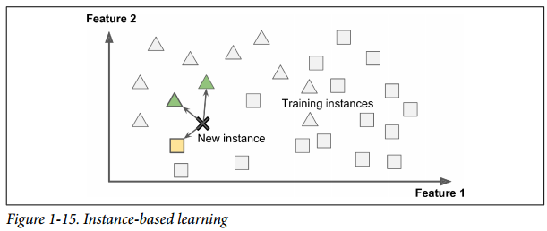

# 什么是机器学习(Machine Learning)

1. > [Machine Learning is the] field of study that gives computers the ability to learn
without being explicitly programmed.
—Arthur Samuel, 1959

   > 使得计算机具有学习的能力，这一切不需要显式地通过编程实现。

2. > A computer program is said to learn from experience E with respect to some task T
and some performance measure P, if its performance on T, as measured by P,
improves with experience E.
—Tom Mitchell, 1997

   > 任务，知识，度量

# 举例：垃圾邮件过滤器
## 传统方法

## 机器学习

## 自动适应变化

## 帮助人们学习到知识
* (经典的例子有"啤酒和尿布"，注意这里是机器学习，不是深度学习)


# 应用举例
1. > Analyzing images of products on a production line to automatically classify them.

   > 图片分类，典型情况下使用convolutional neural networks (CNN, 卷积神经网络)

2. > Detecting tumors in brain scans.

   > 这是语义分割，其中图像中的每个像素被分类(正如我们想要确定的肿瘤的确切位置和形状)，通常也使用CNN.

3. > Automatically classifying news articles.

   > 这是自然语言处理(NLP)，更具体地说是文本分类，可以使用递归神经网络(RNNs)、CNNs或转换器(编码器解码器)来处理.

4. > Automatically flagging offensive comments on discussion forums.

   > 这也是文本分类，使用相同的NLP工具.   
5. > Summarizing long documents automatically.

   > 这是NLP的一个分支，称为文本摘要，同样使用相同的工具.
   
6. > Creating a chatbot or a personal assistant.

   > 这涉及到许多NLP组件，包括自然语言理解(NLU)和问答模块.

7. > Forecasting your company’s revenue next year, based on many performance metrics.

   > 这是一个回归任务。(如预测值)，可以使用任何回归模型处理，例如线性回归或多项式回归模型(见第4章)、回归支持向量机(见第5章)、回归随机森林(见第7章)或人工神经网络(见第10章)。如果你想考虑过去的一系列性能指标，你可能想要使用RNNs、CNNs或转换器(参见第15和16章)。

8. > Making your app react to voice commands.

   > 这就是语音识别，它需要处理音频样本:因为它们是长而复杂的序列，通常使用RNNs、CNNs或转换器来处理它们(见第15和16章).

9. > Detecting credit card fraud.

   > 这就是异常检测(见第9章).

10. > Segmenting clients based on their purchases so that you can design a different marketing strategy for each segment.

    > 聚类(see Chapter 9)

11. > Representing a complex, high-dimensional dataset in a clear and insightful diagram.

    > 这就是数据可视化，通常涉及到降维技术.
    
12. > Recommending a product that a client may be interested in, based on past purchases.

    > 这是一个推荐系统。一种方法是将过去的购买行为(以及客户的其他信息)输入人工神经网络，并让它输出最有可能的下一次购买行为。这个神经网络通常会根据所有客户过去的购买序列进行训练.

13. > Building an intelligent bot for a game.

    > 这通常通过强化学习(RL;参见第18章)，它是机器学习的一个分支，在一个给定的环境(比如游戏)中，训练代理(比如机器人)选择在一段时间内将他们的奖励最大化的行动(例如，机器人可能会在玩家每次失去一些生命值时获得奖励)。在围棋比赛中打败世界冠军的著名AlphaGo程序就是使用RL构建的。

# 机器学习系统的类型
## 分类标准(互不相斥)
1. 是否通过人类监督学习(supervised, unsupervised, semisupervised, and Reinforcement Learning)    
2. 是否能够增量学习(online versus batch learning)
3. 是否通过对比新数据与已知数据得到结论，还是通过训练数据得到检测模式，建立预测模型(instance-based versus model-based learning)

## Supervised/Unsupervised Learning(监督学习，非监督学习)
1. 监督学习(supervised learning)
2. 非监督学习(unsupervised learning)
3. 半监督学习(semisupervised learning)
4. 加强学习(Reinforcement Learning.)

### Supervised learning
喂给算法训练数据(包含预期的答案，即"标签"(label))


* 典型的一个监督学习任务是分类(classification)，比如垃圾邮件过滤器
* 还有一个典型的任务是预测数值，比如汽车的价格。给定一组特征(历程数，车龄，品牌等),即预测器(predictors),这种类型的任务称为回归(regression).


一些回归算法也可以用于分类任务，反之亦然。比如逻辑斯特回归(Logistic Regression)被广泛用于分类任务，因为它能够输出一个数值，而这个数值对应于属于某个分类的概率(比如说20%的可能性为垃圾邮件)


以下是一些重要的监督学习算法
* k-Nearest Neighbors
* Linear Regression
* Logistic Regression
* Support Vector Machines (SVMs)
* Decision Trees and Random Forests
* Neural networks

### Unsupervised learning
* 训练数据是不带标签的。


以下是大部分重要的非监督学习算法：

* Clustering（聚类）
* *  K-Means
* * DBSCAN （(Density-Based Spatial Clustering of Applications with Noise)）
* * Hierarchical Cluster Analysis (HCA)
* Anomaly detection and novelty detection
* * One-class SVM
* * Isolation Forest
* Visualization and dimensionality reduction
* * Principal Component Analysis (PCA)
* * Kernel PCA
* * Locally Linear Embedding (LLE)
* * t-Distributed Stochastic Neighbor Embedding (t-SNE)
* Association rule learning
* * Apriori
* * Eclat

### Semisupervised learning

一些照片托管服务，比如谷歌Photos，就是很好的例子。一旦你把所有的家庭照片上传到这个服务中，它就会自动识别出同一个人A出现在了照片1、5和11中，而另一个人B出现在了照片2、5和7中。这是算法的无监督部分(聚类)。现在系统需要你告诉它这些人是谁。只需为每个人添加一个标签，它就能够在每张照片中命名每个人，这对搜索照片很有用

### Reinforcement Learning

强化学习是非常不同的。学习系统在这里被称为代理(*agent*)，它可以观察环境，选择和执行行为，并得到回报的奖励(*rewards*)(或者负奖励形式的惩罚(*penalties*))。然后它必须自己学习什么是最好的策略，称为策略(*policy*)，随着时间的推移获得最大的回报。策略定义了代理在给定情况下应该选择的操作。


## Batch and Online Learning

### Batch learning

无法进行增量学习，一次需要使用全部的数据进行离线训练(offline training)。如果有新的数据加入，则需要从头训练一次模型。

### Online learning

每次使用单个实例或者一小组实例称为 mini batch


Online learning 适用于以下几种情况：
1. 数据为持续不断的数据流
2. 计算资源有限，一旦学习到了某个实例，该实例的原始数据可以丢弃
3. 训练数据过大，无法载入内存(*out of core learning*)

有一个重要的超参数称为学习率(*learning rate*)，即以多快的速度应用新学习到的知识。高学习率，将更快地遗忘过去的知识，低学习率将降低对于新数据当中的噪音和离群点。

## Instance-Based Versus Model-Based Learning

### Instance-based learning

系统将记牢训练数据，在对新的数据进行预测时，通过某种方法衡量新数据与已知数据的相似度。



### Model-based learning


举例：GDP与幸福度的关联


#### Life satisfaction Data description
> 
    Int64Index: 3292 entries, 0 to 3291
    Data columns (total 17 columns):
    "LOCATION"              3292 non-null object
    Country                  3292 non-null object
    INDICATOR                3292 non-null object
    Indicator                3292 non-null object
    MEASURE                  3292 non-null object
    Measure                  3292 non-null object
    INEQUALITY               3292 non-null object
    Inequality               3292 non-null object
    Unit Code                3292 non-null object
    Unit                     3292 non-null object
    PowerCode Code           3292 non-null int64
    PowerCode                3292 non-null object
    Reference Period Code    0 non-null float64
    Reference Period         0 non-null float64
    Value                    3292 non-null float64
    Flag Codes               1120 non-null object
    Flags                    1120 non-null object
    dtypes: float64(3), int64(1), object(13)

#### GDP per capita Data description
> 
    Int64Index: 190 entries, 0 to 189
    Data columns (total 7 columns):
    Country                          190 non-null object
    Subject Descriptor               189 non-null object
    Units                            189 non-null object
    Scale                            189 non-null object
    Country/Series-specific Notes    188 non-null object
    2015                             187 non-null float64
    Estimates Start After            188 non-null float64
    dtypes: float64(2), object(5)
    memory usage: 11.9+ KB

> life_satisfaction = θ0 + θ1 × GDP_per_capita

在决定这两个参数的时候，需要一个性能方法(utility function/fitness function)来衡量模型的有多好(cost function 用于衡量模型有多坏)

整个处理的过程；
1. 研究数据
2. 选择模型
3. 训练模型
4. 使用模型预测

[Example 1-1](EXAMPLE/1-1.py "")
```python
import sys
assert sys.version_info >= (3, 5)
import sklearn
assert sklearn.__version__ >= "0.20"

import os
datapath = os.path.join("datasets", "lifesat", "")

import matplotlib as mpl
mpl.rc('axes', labelsize=14)
mpl.rc('xtick', labelsize=12)
mpl.rc('ytick', labelsize=12)

# Download the data
import urllib.request as urlrequest
DOWNLOAD_ROOT = "https://raw.githubusercontent.com/ageron/handson-ml2/master/"
os.makedirs(datapath, exist_ok=True)
for filename in ("oecd_bli_2015.csv", "gdp_per_capita.csv"):
    if not os.path.exists(datapath + filename):
        print("Downloading", filename)
        url = DOWNLOAD_ROOT + "datasets/lifesat/" + filename
        urlrequest.urlretrieve(url, datapath + filename)
    print("File " + filename + " existed")

import matplotlib.pyplot as plt
import numpy as np
import pandas as pd

# Load the data
oecd_bli = pd.read_csv(datapath + "oecd_bli_2015.csv", thousands=',')
gdp_per_capita = pd.read_csv(datapath + "gdp_per_capita.csv",thousands=',',delimiter='\t',
                             encoding='latin1', na_values="n/a")

# Prepare the data
def prepare_country_stats(oecd_bli, gdp_per_capita):
    oecd_bli = oecd_bli[oecd_bli["INEQUALITY"]=="TOT"]
    # 之前的country列作为索引，之前的indicator列作为列名，之前的value列作为数据
    oecd_bli = oecd_bli.pivot(index="Country", columns="Indicator", values="Value")
    # 重命名列名
    gdp_per_capita.rename(columns={"2015": "GDP per capita"}, inplace=True)
    # 修改索引
    gdp_per_capita.set_index("Country", inplace=True)
    # 根据Conutry列合并两份数据
    full_country_stats = pd.merge(left=oecd_bli, right=gdp_per_capita,
                                  left_index=True, right_index=True)
    # 数据排序                               
    full_country_stats.sort_values(by="GDP per capita", inplace=True)
    remove_indices = [0, 1, 6, 8, 33, 34, 35]
    keep_indices = list(set(range(36)) - set(remove_indices))
    # 取部分数据
    return full_country_stats[["GDP per capita", 'Life satisfaction']].iloc[keep_indices]


country_stats = prepare_country_stats(oecd_bli, gdp_per_capita)
print("Data prehandled")
X = np.c_[country_stats["GDP per capita"]]
y = np.c_[country_stats["Life satisfaction"]]

# Visualize the data
country_stats.plot(kind='scatter', x="GDP per capita", y='Life satisfaction')
# plt.show()

# Select a linear model
# import sklearn.linear_model
# model = sklearn.linear_model.LinearRegression()

import sklearn.neighbors
model = sklearn.neighbors.KNeighborsRegressor(n_neighbors=3)

# Train the model
model.fit(X, y)

# Make a prediction for Cyprus
X_new = [[22587]]  # Cyprus' GDP per capita
print(model.predict(X_new)) # outputs [[ 5.96242338]]


```

## Main Challenges of Machine Learning
