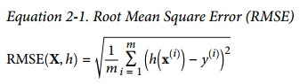
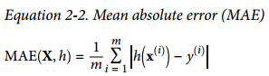
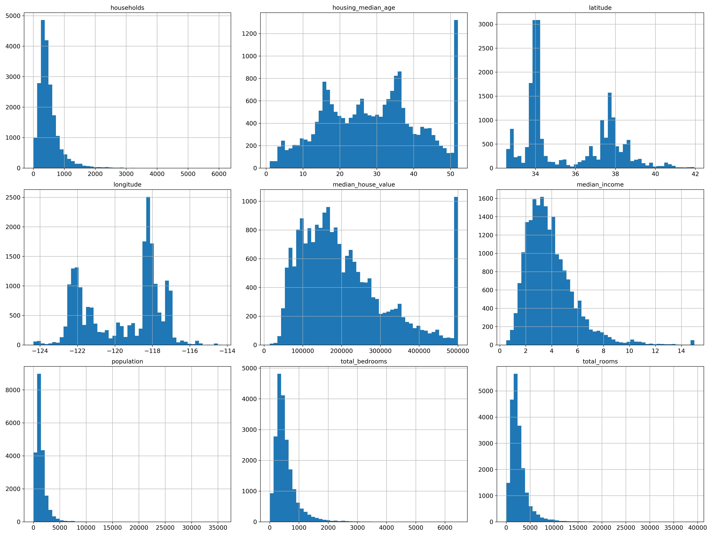
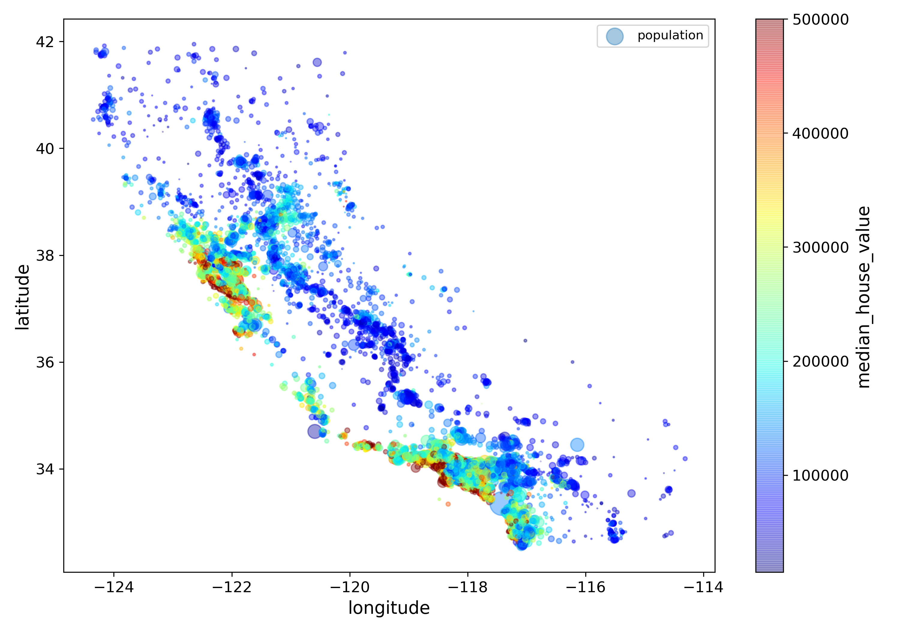
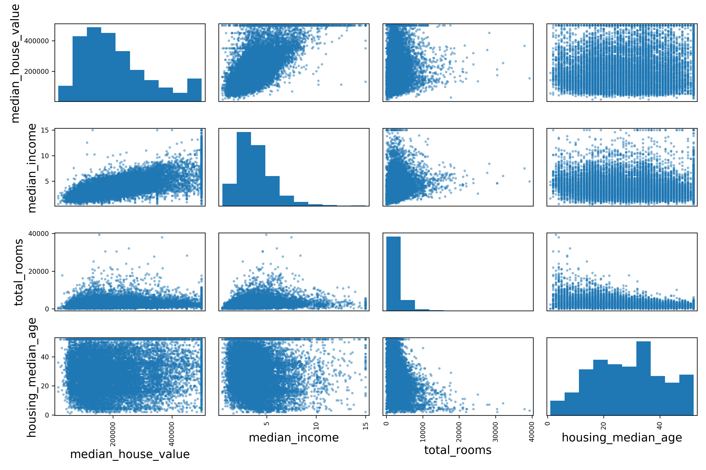
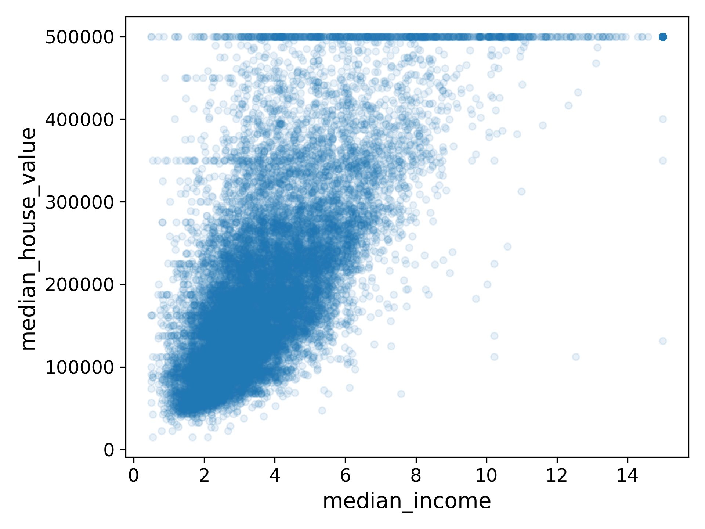

# Working with Real Data

# Look at the Big Picture

这里以预测房价为例

## Frame the Problem

明确模型的输出数据内容及用途
是一个监督学习，回归任务，单变量回归，batch learning

## Select a Performance Measure

对于回归问题，典型的衡量标准是Root Mean Square Error (RMSE)，它给出了预测会包含多少误差（对于大误差有更大的权重）



尽管RMSE很常用，也可以选择其他方法来评价。比如有离群点较多，可能会选用MAE(mean absolute error)



> The higher the norm index, the more it focuses on large values and neglects small ones. This is why the RMSE is more sensitive to outliers than the MAE. But when outliers are exponentially rare (like in a bell-shaped curve), the RMSE performs very well and is generally preferred.

## Check the Assumptions


# Get the Data


## Create a Test Set

[Refs.  ](EXAMPLE/2-1.py "")

## Discover and Visualize the Data to Gain Insights

### Visualizing Geographical Data
```python
print(housing.head())
```

>           
            longitude  latitude  housing_median_age  total_rooms  total_bedrooms  population  households  median_income  median_house_value ocean_proximity
        0    -122.23     37.88                41.0        880.0           129.0       322.0       126.0         8.3252            452600.0        NEAR BAY
        1    -122.22     37.86                21.0       7099.0          1106.0      2401.0      1138.0         8.3014            358500.0        NEAR BAY
        2    -122.24     37.85                52.0       1467.0           190.0       496.0       177.0         7.2574            352100.0        NEAR BAY
        3    -122.25     37.85                52.0       1274.0           235.0       558.0       219.0         5.6431            341300.0        NEAR BAY
        4    -122.25     37.85                52.0       1627.0           280.0       565.0       259.0         3.8462            342200.0        NEAR BAY

```python
print(housing.info())
```
>   
    <class 'pandas.core.frame.DataFrame'>
    RangeIndex: 20640 entries, 0 to 20639
    Data columns (total 10 columns):
    longitude             20640 non-null float64
    latitude              20640 non-null float64
    housing_median_age    20640 non-null float64
    total_rooms           20640 non-null float64
    total_bedrooms        20433 non-null float64
    population            20640 non-null float64
    households            20640 non-null float64
    median_income         20640 non-null float64
    median_house_value    20640 non-null float64
    ocean_proximity       20640 non-null object
    dtypes: float64(9), object(1)
    memory usage: 1.6+ MB
    None

```python
print(housing["ocean_proximity"].value_counts())
```
>
    <1H OCEAN     9136
    INLAND        6551
    NEAR OCEAN    2658
    NEAR BAY      2290
    ISLAND           5
    Name: ocean_proximity, dtype: int64


```python
print(housing.describe())
```
>
             longitude      latitude  housing_median_age   total_rooms  total_bedrooms    population    households  median_income  median_house_value
    count  20640.000000  20640.000000        20640.000000  20640.000000    20433.000000  20640.000000  20640.000000   20640.000000        20640.000000
    mean    -119.569704     35.631861           28.639486   2635.763081      537.870553   1425.476744    499.539680       3.870671       206855.816909
    std        2.003532      2.135952           12.585558   2181.615252      421.385070   1132.462122    382.329753       1.899822       115395.615874
    min     -124.350000     32.540000            1.000000      2.000000        1.000000      3.000000      1.000000       0.499900        14999.000000
    25%     -121.800000     33.930000           18.000000   1447.750000      296.000000    787.000000    280.000000       2.563400       119600.000000
    50%     -118.490000     34.260000           29.000000   2127.000000      435.000000   1166.000000    409.000000       3.534800       179700.000000
    75%     -118.010000     37.710000           37.000000   3148.000000      647.000000   1725.000000    605.000000       4.743250       264725.000000
    max     -114.310000     41.950000           52.000000  39320.000000     6445.000000  35682.000000   6082.000000      15.000100       500001.000000


```python
housing.hist(bins=50, figsize=(20,15))
plt.show()
```

    
```python
housing.plot(kind="scatter", x="longitude", y="latitude", alpha=0.4,
    s=housing["population"]/100, label="population", figsize=(10,7),
    c="median_house_value", cmap=plt.get_cmap("jet"), colorbar=True,
    sharex=False)
```



### Looking for Correlations

```python
print("corr_matrix = housing.corr()")
corr_matrix = housing.corr()
print(corr_matrix)
```
>
                         longitude  latitude  housing_median_age  total_rooms  total_bedrooms  population  households  median_income  median_house_value
    longitude            1.000000 -0.924478           -0.105848     0.048871        0.076598    0.108030    0.063070      -0.019583           -0.047432
    latitude            -0.924478  1.000000            0.005766    -0.039184       -0.072419   -0.115222   -0.077647      -0.075205           -0.142724
    housing_median_age  -0.105848  0.005766            1.000000    -0.364509       -0.325047   -0.298710   -0.306428      -0.111360            0.114110
    total_rooms          0.048871 -0.039184           -0.364509     1.000000        0.929379    0.855109    0.918392       0.200087            0.135097
    total_bedrooms       0.076598 -0.072419           -0.325047     0.929379        1.000000    0.876320    0.980170      -0.009740            0.047689
    population           0.108030 -0.115222           -0.298710     0.855109        0.876320    1.000000    0.904637       0.002380           -0.026920
    households           0.063070 -0.077647           -0.306428     0.918392        0.980170    0.904637    1.000000       0.010781            0.064506
    median_income       -0.019583 -0.075205           -0.111360     0.200087       -0.009740    0.002380    0.010781       1.000000            0.687160
    median_house_value  -0.047432 -0.142724            0.114110     0.135097        0.047689   -0.026920    0.064506       0.687160            1.000000

```python
print(corr_matrix["median_house_value"].sort_values(ascending=False))
```
>
    median_house_value    1.000000
    median_income         0.687160
    total_rooms           0.135097
    housing_median_age    0.114110
    households            0.064506
    total_bedrooms        0.047689
    population           -0.026920
    longitude            -0.047432
    latitude             -0.142724

```python
from pandas.plotting import scatter_matrix
attributes = ["median_house_value", "median_income", "total_rooms", "housing_median_age"]
scatter_matrix(housing[attributes], figsize=(12, 8))
```


```python
housing.plot(kind="scatter", x="median_income", y="median_house_value",
alpha=0.1)
```


### Experimenting with Attribute Combinations
```python
housing["rooms_per_household"] = housing["total_rooms"]/housing["households"]
housing["bedrooms_per_room"] = housing["total_bedrooms"]/housing["total_rooms"]
housing["population_per_household"]=housing["population"]/housing["households"]

corr_matrix = housing.corr()
print(corr_matrix["median_house_value"].sort_values(ascending=False))
```
>
    median_house_value          1.000000
    median_income               0.687160
    rooms_per_household         0.146285
    total_rooms                 0.135097
    housing_median_age          0.114110
    households                  0.064506
    total_bedrooms              0.047689
    population_per_household   -0.021985
    population                 -0.026920
    longitude                  -0.047432
    latitude                   -0.142724
    bedrooms_per_room          -0.259984
    Name: median_house_value, dtype: float64


## Prepare the Data for Machine Learning Algorithms

```python
housing = strat_train_set.drop("median_house_value", axis=1)
housing_labels = strat_train_set["median_house_value"].copy()
```

### Data Cleaning
某些数据特征缺失时，一般使用以下三种方法进行处理：
1. 丢弃该条数据
2. 丢弃该特征
3. 补充该特征数据（0，平均数，中位数等）

分别对应以下实现：
>
    housing.dropna(subset=["total_bedrooms"]) # option 1
    housing.drop("total_bedrooms", axis=1) # option 2
    median = housing["total_bedrooms"].median() # option 3
    housing["total_bedrooms"].fillna(median, inplace=True)

Scikit-Learn提供了一个方法来解决这个问题

```python
from sklearn.impute import SimpleImputer
imputer = SimpleImputer(strategy="median")
```

Since the median can only be computed on numerical attributes, you need to create a
copy of the data without the text attribute ocean_proximity:
```python
housing_num = housing.drop("ocean_proximity", axis=1)
imputer.fit(housing_num)
```

```python
print(imputer.statistics_)
# array([ -118.51 , 34.26 , 29. , 2119.5 , 433. , 1164. , 408. , 3.5409])
```

```python
housing_num.median().values
# array([ -118.51 , 34.26 , 29. , 2119.5 , 433. , 1164. , 408. , 3.5409])
```
```python
X = imputer.transform(housing_num)

```

The result is a plain NumPy array containing the transformed features. If you want to put it back into a pandas DataFrame, it’s simple:
```python
housing_tr = pd.DataFrame(X, columns=housing_num.columns, index=housing_num.index)
```

#### Scikit-Learn Design
>
    <center>Scikit-Learn Design</center>
    Scikit-Learn’s API is remarkably well designed. These are the main design principles:

    Consistency
        All objects share a consistent and simple interface:

        Estimators
            Any object that can estimate some parameters based on a dataset is called an
            estimator (e.g., an imputer is an estimator). The estimation itself is per‐
            formed by the fit() method, and it takes only a dataset as a parameter (or
            two for supervised learning algorithms; the second dataset contains the
            labels). Any other parameter needed to guide the estimation process is con‐
            sidered a hyperparameter (such as an imputer’s strategy), and it must be
            set as an instance variable (generally via a constructor parameter).

        Transformers
            Some estimators (such as an imputer) can also transform a dataset; these are
            called transformers. Once again, the API is simple: the transformation is
            performed by the transform() method with the dataset to transform as a
            parameter. It returns the transformed dataset. This transformation generally
            relies on the learned parameters, as is the case for an imputer. All transform‐
            ers also have a convenience method called fit_transform() that is equiva‐
            lent to calling fit() and then transform() (but sometimes
            fit_transform() is optimized and runs much faster).

        Predictors
            Finally, some estimators, given a dataset, are capable of making predictions;
            they are called predictors. For example, the LinearRegression model in the
            previous chapter was a predictor: given a country’s GDP per capita, it pre‐
            dicted life satisfaction. A predictor has a predict() method that takes a
            dataset of new instances and returns a dataset of corresponding predictions.
            It also has a score() method that measures the quality of the predictions,
            given a test set (and the corresponding labels, in the case of supervised learn‐
            ing algorithms).

    Inspection
        All the estimator’s hyperparameters are accessible directly via public instance
        variables (e.g., imputer.strategy), and all the estimator’s learned parameters are
        accessible via public instance variables with an underscore suffix (e.g.,
        imputer.statistics_)            

    Nonproliferation of classes
        Datasets are represented as NumPy arrays or SciPy sparse matrices, instead of
        homemade classes. Hyperparameters are just regular Python strings or numbers.
    Composition
        Existing building blocks are reused as much as possible. For example, it is easy to
        create a Pipeline estimator from an arbitrary sequence of transformers followed
        by a final estimator, as we will see.
    Sensible defaults
        Scikit-Learn provides reasonable default values for most parameters, making it
        easy to quickly create a baseline working system

### Handling Text and Categorical Attributes

* “ocean_proximity”特征并不是随机的字符串，而是一个有限的集合，可以转换成机器擅长处理的数字型特征
```python
housing_cat = housing[["ocean_proximity"]]
housing_cat.head(10)

#     ocean_proximity
# 17606       <1H OCEAN
# 18632       <1H OCEAN
# 14650       NEAR OCEAN
# 3230        INLAND
# 3555        <1H OCEAN
# 19480       INLAND
# 8879        <1H OCEAN
# 13685       INLAND
# 4937        <1H OCEAN
# 4861         <1H OCEAN
```


```python
from sklearn.preprocessing import OrdinalEncoder

ordinal_encoder = OrdinalEncoder()
housing_cat_encoded = ordinal_encoder.fit_transform(housing_cat)
housing_cat_encoded[:10]
```

```python
>>> from sklearn.preprocessing import OrdinalEncoder
>>> ordinal_encoder = OrdinalEncoder()
>>> housing_cat_encoded = ordinal_encoder.fit_transform(housing_cat)
>>> housing_cat_encoded[:10]
array([[0.],
[0.],
[4.],
[1.],
[0.],
[1.],
[0.],
[1.],
[0.],
[0.]])

>>> ordinal_encoder.categories_
[array(['<1H OCEAN', 'INLAND', 'ISLAND', 'NEAR BAY', 'NEAR OCEAN'], dtype=object)]
```

这样做存在的一个问题是，机器学习算法有一个假设：两个更近的数值比更远的数值更加相似。
显然这里不太合适。
有一个解决方法称为"one-hot encoding"

```python
>>> from sklearn.preprocessing import OneHotEncoder
>>> cat_encoder = OneHotEncoder()
>>> housing_cat_1hot = cat_encoder.fit_transform(housing_cat)
>>> housing_cat_1hot
<16512x5 sparse matrix of type '<class 'numpy.float64'>'
with 16512 stored elements in Compressed Sparse Row format>
```
* Notice that the output is a SciPy sparse matrix, instead of a NumPy array

```python
>>> housing_cat_1hot.toarray()
array([[1., 0., 0., 0., 0.],
[1., 0., 0., 0., 0.],
[0., 0., 0., 0., 1.],
...,
[0., 1., 0., 0., 0.],
[1., 0., 0., 0., 0.],
[0., 0., 0., 1., 0.]])

>>> cat_encoder.categories_
[array(['<1H OCEAN', 'INLAND', 'ISLAND', 'NEAR BAY', 'NEAR OCEAN'],
dtype=object)]
```

## Custom Transformers
自定义一个transformer需要创建一个类，并实现三个方法: fit, transform, fit_transform
fit_transform这个方法可以简单通过继承TransformerMixin来得到。
如果将BaseEstimator作为基类,并且在构造函数中没有参数，就会得到两个额外方法get_params()/set_params()，用于超参数自动调优。

```python
from sklearn.base import BaseEstimator, TransformerMixin

rooms_ix, bedrooms_ix, population_ix, households_ix = 3, 4, 5, 6

class CombinedAttributesAdder(BaseEstimator, TransformerMixin):
    def __init__(self, add_bedrooms_per_room = True): # no *args or **kargs
        self.add_bedrooms_per_room = add_bedrooms_per_room
    def fit(self, X, y=None):
        return self # nothing else to do
    def transform(self, X):
        rooms_per_household = X[:, rooms_ix] / X[:, households_ix]
        population_per_household = X[:, population_ix] / X[:, households_ix]
        if self.add_bedrooms_per_room:
            bedrooms_per_room = X[:, bedrooms_ix] / X[:, rooms_ix]
            return np.c_[X, rooms_per_household, population_per_household, bedrooms_per_room]
        else:
            return np.c_[X, rooms_per_household, population_per_household]

attr_adder = CombinedAttributesAdder(add_bedrooms_per_room=False)
housing_extra_attribs = attr_adder.transform(housing.values)
```

### Feature Scaling
机器学习算法在输入数值属性范围差异较大时，表现得不太好。
有两个通用方法解决：min-max scaling and standardization.

* Min-max scaling (many people call this normalization)

转换到区间[0, 1]，对每个数据进行操作：减去最小值，除以最大值与最小值的差。Scikit-Learn提供了MinMaxScaler，它有一个超参数feature_range，用于改变转换后的数值区间（如果不想使用[0,1]）

* standardization
首先减去均值（处理后的数据均值为0），然后除以标准差（处理后的数据标准差为1）。
StandardScaler

### Transformation Pipelines
Scikit-Learn提供了Pipeline串联多个transformer
```python
from sklearn.pipeline import Pipeline
from sklearn.preprocessing import StandardScaler
num_pipeline = Pipeline([
    ('imputer', SimpleImputer(strategy="median")),
    ('attribs_adder', CombinedAttributesAdder()),
    ('std_scaler', StandardScaler()),
    ])
housing_num_tr = num_pipeline.fit_transform(housing_num)
```
除了最后一个之外都必须是transformer，（比如必须有fit_transform()方法）。
当调用pipeline的fit()方法时，它将调用顺序调用每一个transformer的fit_transform()方法，将上一个transfomer的输出作为后一个transfomer的输入，直到最后一个estimator，它将调用fit()方法。
pipeline暴露了与最后一个estimator相同的方法，这里是一个StandardScaler(是一个transformer)，所以这个pipeline有transfomer() 及 fit_transformer()方法。

```python
from sklearn.compose import ColumnTransformer
num_attribs = list(housing_num)
cat_attribs = ["ocean_proximity"]
full_pipeline = ColumnTransformer([
    ("num", num_pipeline, num_attribs),
    ("cat", OneHotEncoder(), cat_attribs),
    ])
housing_prepared = full_pipeline.fit_transform(housing)
```

## Select and Train a Model
### Training and Evaluating on the Training Set
```python
from sklearn.linear_model import LinearRegression
# training
lin_reg = LinearRegression()
lin_reg.fit(housing_prepared, housing_labels)

# predict
>>> some_data = housing.iloc[:5]
>>> some_labels = housing_labels.iloc[:5]
>>> some_data_prepared = full_pipeline.transform(some_data)
>>> print("Predictions:", lin_reg.predict(some_data_prepared))
Predictions: [ 210644.6045 317768.8069 210956.4333 59218.9888 189747.5584]
>>> print("Labels:", list(some_labels))
Labels: [286600.0, 340600.0, 196900.0, 46300.0, 254500.0]
```

```python
# calculate MSE
>>> from sklearn.metrics import mean_squared_error
>>> housing_predictions = lin_reg.predict(housing_prepared)
>>> lin_mse = mean_squared_error(housing_labels, housing_predictions)
>>> lin_rmse = np.sqrt(lin_mse)
>>> lin_rmse
68628.19819848922
```


```python
from sklearn.tree import DecisionTreeRegressor
tree_reg = DecisionTreeRegressor()
tree_reg.fit(housing_prepared, housing_labels)
# Now that the model is trained, let’s evaluate it on the training set:
>>> housing_predictions = tree_reg.predict(housing_prepared)
>>> tree_mse = mean_squared_error(housing_labels, housing_predictions)
>>> tree_rmse = np.sqrt(tree_mse)
>>> tree_rmse
0.0
```
### Better Evaluation Using Cross-Validation
交叉验证
```python
# 决策树模型
from sklearn.model_selection import cross_val_score
scores = cross_val_score(tree_reg, housing_prepared, housing_labels,
    scoring="neg_mean_squared_error", cv=10)
tree_rmse_scores = np.sqrt(-scores)

>>> def display_scores(scores):
... print("Scores:", scores)
... print("Mean:", scores.mean())
... print("Standard deviation:", scores.std())
...
>>> display_scores(tree_rmse_scores)
Scores: [70194.33680785 66855.16363941 72432.58244769 70758.73896782
71115.88230639 75585.14172901 70262.86139133 70273.6325285
75366.87952553 71231.65726027]
Mean: 71407.68766037929
Standard deviation: 2439.4345041191004
```
```python
# 线性回归模型
>>> lin_scores = cross_val_score(lin_reg, housing_prepared, housing_labels,
... scoring="neg_mean_squared_error", cv=10)
...
>>> lin_rmse_scores = np.sqrt(-lin_scores)
>>> display_scores(lin_rmse_scores)
Scores: [66782.73843989 66960.118071 70347.95244419 74739.57052552
68031.13388938 71193.84183426 64969.63056405 68281.61137997
71552.91566558 67665.10082067]
Mean: 69052.46136345083
Standard deviation: 2731.674001798348
```

```python
# 随机森林模型
>>> from sklearn.ensemble import RandomForestRegressor
>>> forest_reg = RandomForestRegressor()
>>> forest_reg.fit(housing_prepared, housing_labels)
>>> [...]
>>> forest_rmse
18603.515021376355
>>> display_scores(forest_rmse_scores)
Scores: [49519.80364233 47461.9115823 50029.02762854 52325.28068953
49308.39426421 53446.37892622 48634.8036574 47585.73832311
53490.10699751 50021.5852922 ]
Mean: 50182.303100336096
Standard deviation: 2097.0810550985693
```

```python
# 保存模型（超参数和模型参数）
import joblib
joblib.dump(my_model, "my_model.pkl")
# and later...
my_model_loaded = joblib.load("my_model.pkl")
```

## Fine-Tune Your Model
### Grid Search

```python
from sklearn.model_selection import GridSearchCV
param_grid = [
    {'n_estimators': [3, 10, 30], 'max_features': [2, 4, 6, 8]},
    {'bootstrap': [False], 'n_estimators': [3, 10], 'max_features': [2, 3, 4]},
    ]
forest_reg = RandomForestRegressor()
grid_search = GridSearchCV(forest_reg, param_grid, cv=5,
                                                            scoring='neg_mean_squared_error',
                                                            return_train_score=True)
grid_search.fit(housing_prepared, housing_labels)

# 搜索出的来的最优超参数
>>> grid_search.best_params_
{'max_features': 8, 'n_estimators': 30}

# 搜索出来的最优超参数对应的模型
>>> grid_search.best_estimator_
RandomForestRegressor(bootstrap=True, criterion='mse', max_depth=None,
max_features=8, max_leaf_nodes=None, min_impurity_decrease=0.0,
min_impurity_split=None, min_samples_leaf=1,
min_samples_split=2, min_weight_fraction_leaf=0.0,
n_estimators=30, n_jobs=None, oob_score=False, random_state=None,
verbose=0, warm_start=False)

>>> cvres = grid_search.cv_results_
>>> for mean_score, params in zip(cvres["mean_test_score"], cvres["params"]):
... print(np.sqrt(-mean_score), params)
...
63669.05791727153 {'max_features': 2, 'n_estimators': 3}
55627.16171305252 {'max_features': 2, 'n_estimators': 10}
53384.57867637289 {'max_features': 2, 'n_estimators': 30}
60965.99185930139 {'max_features': 4, 'n_estimators': 3}
52740.98248528835 {'max_features': 4, 'n_estimators': 10}
50377.344409590376 {'max_features': 4, 'n_estimators': 30}
58663.84733372485 {'max_features': 6, 'n_estimators': 3}
52006.15355973719 {'max_features': 6, 'n_estimators': 10}
50146.465964159885 {'max_features': 6, 'n_estimators': 30}
57869.25504027614 {'max_features': 8, 'n_estimators': 3}
51711.09443660957 {'max_features': 8, 'n_estimators': 10}
49682.25345942335 {'max_features': 8, 'n_estimators': 30}
62895.088889905004 {'bootstrap': False, 'max_features': 2, 'n_estimators': 3}
54658.14484390074 {'bootstrap': False, 'max_features': 2, 'n_estimators': 10}
59470.399594730654 {'bootstrap': False, 'max_features': 3, 'n_estimators': 3}
52725.01091081235 {'bootstrap': False, 'max_features': 3, 'n_estimators': 10}
57490.612956065226 {'bootstrap': False, 'max_features': 4, 'n_estimators': 3}
51009.51445842374 {'bootstrap': False, 'max_features': 4, 'n_estimators': 10}
```

### Randomized Search
```python
RandomizedSearchCV
```

### Ensemble Methods


### Analyze the Best Models and Their Errors
```python
>>> feature_importances = grid_search.best_estimator_.feature_importances_
>>> feature_importances
array([7.33442355e-02, 6.29090705e-02, 4.11437985e-02, 1.46726854e-02,
    1.41064835e-02, 1.48742809e-02, 1.42575993e-02, 3.66158981e-01,
    5.64191792e-02, 1.08792957e-01, 5.33510773e-02, 1.03114883e-02,
    1.64780994e-01, 6.02803867e-05, 1.96041560e-03, 2.85647464e-03])


>>> extra_attribs = ["rooms_per_hhold", "pop_per_hhold", "bedrooms_per_room"]
>>> cat_encoder = full_pipeline.named_transformers_["cat"]
>>> cat_one_hot_attribs = list(cat_encoder.categories_[0])
>>> attributes = num_attribs + extra_attribs + cat_one_hot_attribs
>>> sorted(zip(feature_importances, attributes), reverse=True)
[(0.3661589806181342, 'median_income'),
(0.1647809935615905, 'INLAND'),
(0.10879295677551573, 'pop_per_hhold'),
(0.07334423551601242, 'longitude'),
(0.0629090704826203, 'latitude'),
(0.05641917918195401, 'rooms_per_hhold'),
(0.05335107734767581, 'bedrooms_per_room'),
(0.041143798478729635, 'housing_median_age'),
(0.014874280890402767, 'population'),
(0.014672685420543237, 'total_rooms'),
(0.014257599323407807, 'households'),
(0.014106483453584102, 'total_bedrooms'),
(0.010311488326303787, '<1H OCEAN'),
(0.002856474637320158, 'NEAR OCEAN'),
(0.00196041559947807, 'NEAR BAY'),
(6.028038672736599e-05, 'ISLAND')]
```

### Evaluate Your System on the Test Set
```python
final_model = grid_search.best_estimator_
X_test = strat_test_set.drop("median_house_value", axis=1)
y_test = strat_test_set["median_house_value"].copy()
X_test_prepared = full_pipeline.transform(X_test)

final_predictions = final_model.predict(X_test_prepared)
final_mse = mean_squared_error(y_test, final_predictions)
final_rmse = np.sqrt(final_mse) # => evaluates to 47,730.2

# 求得95%置信区间
>>> from scipy import stats
>>> confidence = 0.95
>>> squared_errors = (final_predictions - y_test) ** 2
>>> np.sqrt(stats.t.interval(confidence, len(squared_errors) - 1,
... loc=squared_errors.mean(),
... scale=stats.sem(squared_errors)))
...
array([45685.10470776, 49691.25001878])
```


## Launch, Monitor, and Maintain Your System
