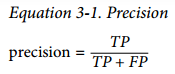
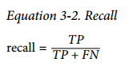
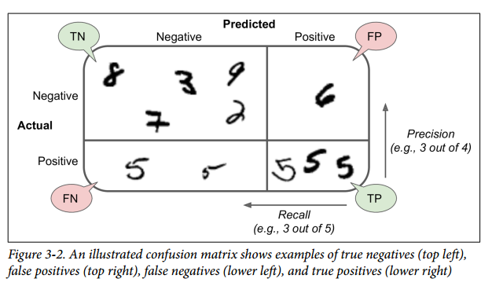

# Classification

## MNIST

```python
>>> from sklearn.datasets import fetch_openml
>>> mnist = fetch_openml('mnist_784', version=1)
>>> mnist.keys()
dict_keys(['data', 'target', 'feature_names', 'DESCR', 'details', 'categories', 'url'])

# • A DESCR key describing the dataset
# • A data key containing an array with one row per instance and one column per
# feature
# • A target key containing an array with the labels

>>> X, y = mnist["data"], mnist["target"]
>>> X.shape
(70000, 784) # 70000 * 28 * 28
>>> y.shape
(70000,)

X_train, X_test, y_train, y_test = X[:60000], X[60000:], y[:60000], y[60000:]
```

## Training a Binary Classifier

```python
y_train_5 = (y_train == 5) # True for all 5s, False for all other digits
y_test_5 = (y_test == 5)


from sklearn.linear_model import SGDClassifier
sgd_clf = SGDClassifier(random_state=42)
sgd_clf.fit(X_train, y_train_5)

>>> sgd_clf.predict([some_digit])
array([ True])
```
## Performance Measures

### Measuring Accuracy Using Cross-Validation
```python
>>> from sklearn.model_selection import cross_val_score
>>> cross_val_score(sgd_clf, X_train, y_train_5, cv=3, scoring="accuracy")
array([0.96355, 0.93795, 0.95615])

```
### Confusion Matrix

```python
from sklearn.model_selection import cross_val_predict
y_train_pred = cross_val_predict(sgd_clf, X_train, y_train_5, cv=3)

>>> from sklearn.metrics import confusion_matrix
>>> confusion_matrix(y_train_5, y_train_pred)
# 每行表示一个实际的分类，每列表示一个预测的分类。
array([[53057, 1522],
[ 1325, 4096]])
#                               |                              |
#   negative class | true negatives | false positives
#   positive class  | false negatives | true positives
#

>>> y_train_perfect_predictions = y_train_5 # pretend we reached perfection
>>> confusion_matrix(y_train_5, y_train_perfect_predictions)
array([[54579, 0],
[ 0, 5421]])


```








